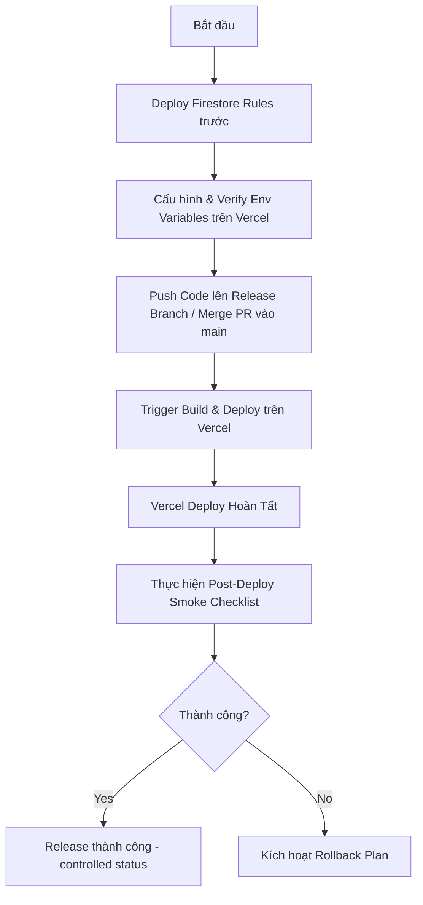

# TRUYEN24H PRODUCTION RELEASE PACKET
## Phase 2.7: Production Readiness & Controlled Release

Tài liệu này đóng vai trò là Release Packet chính thức chuẩn bị cho việc đóng gói và triển khai có kiểm soát phiên bản **truyen24h.vn** lên môi trường Production.

> [!IMPORTANT]
> **Quy tắc tuyệt đối:** Không tự ý deploy, commit hoặc push code lên production/main branch khi chưa được sự cho phép rõ ràng từ Owner dự án. Không log secret và tuyệt đối không test PayOS production bằng giao dịch thật (hoặc tiền thật quy mô lớn).

---

## 1. Rà Diff và Kiểm Soát Secret Trước Release

### 1.1. Danh Sách Files Thay Đổi (Working Tree)

#### Files Nên Commit (Modified & Untracked Code sạch):
- **Cấu hình & Rules:**
  - `firestore.rules`: Cập nhật rules để khóa chặt các collection nhạy cảm.
- **API Routes (Phía Server):**
  - `src/app/api/admin/daily-run/route.ts` & `daily-run-cron/route.ts`: Admin cron/daily jobs.
  - `src/app/api/admin/deploy-rules/route.ts`: Deploy rules endpoint.
  - `src/app/api/admin/generate-blog-post/route.ts`: API sinh bài viết blog qua AI (Operator Draft).
  - `src/app/api/admin/newsletter/list/route.ts`: API liệt kê newsletter.
  - `src/app/api/admin/translate-chapter/route.ts`: API dịch chương qua AI (Operator Draft).
  - `src/app/api/ai/generate-novel/route.ts` & `generate-chapter/route.ts`: API generator lưu nháp.
  - `src/app/api/clean-mock/route.ts`, `fix-chapters/route.ts`, `migrate/route.ts`: Admin maintenance routes.
  - `src/app/api/operator/` (Mới): Gồm các route `approve`, `publish`, `rollback`, `report`.
- **Giao Diện (Client Components & Pages):**
  - `src/app/admin/operator-drafts/` (Mới): Trang quản lý draft queue của Operator.
  - `src/components/OperatorDraftsClient.tsx` (Mới): Client component cho draft queue.
  - `src/components/AdminClientWrapper.tsx` & `AiStudioClient.tsx`: Admin views & AI Studio update.
  - `src/components/DiscoverView.tsx`, `FilterView.tsx`, `NovelDetailView.tsx`: Cập nhật visibility guard lọc truyện ẩn.
  - `src/app/truyen/[slug]/page.tsx`, `src/app/doc/[slug]/[chapter_id]/page.tsx`: SSR filtering.
  - `src/app/blog/page.tsx`, `src/app/blog/[slug]/page.tsx`: Blog list & detail filtering.
  - `src/app/sitemap.ts`: Lọc bỏ truyện nháp/rollback khỏi sitemap.
- **Thư Viện / Helper Logic (Sạch):**
  - `src/lib/visibilityGuard.ts` (Mới): Helper filter public/private items.
  - `src/lib/adminClientAuth.ts` (Mới): Helper lấy authorization token cho admin.
  - `src/lib/operator/` (Mới): Draft & Quality Gate logic.
  - `src/services/geminiService.ts`: Sửa bỏ gọi GoogleGenAI trực tiếp trên client (sử dụng fallback).
  - `src/services/aiBlogService.ts`, `aiStoryService.ts`, `aiTranslateService.ts`: Ràng buộc dùng `GEMINI_API_KEY` phía server.
- **Kiểm thử (Smoke Tests):**
  - `scripts/security-smoke-tests/security-smoke.mjs`: Test suite bảo mật.
  - `scripts/security-smoke-tests/operator-smoke.mjs` (Mới): Test suite vận hành.
- **Tài liệu mới (Docs):**
  - `docs/TRUYEN24H_OPERATOR_PHASE2_QA.md`
  - `docs/TRUYEN24H_P0_12_7_VERCEL_FAILURE_DIAGNOSIS_REPORT.md`
  - `docs/TRUYEN24H_STAGING_RELEASE_CHECKLIST.md`

#### Files KHÔNG Nên Commit:
- `.env.local`: Chứa secret key local của môi trường dev/staging (Tuyệt đối không push lên git).
- Thư mục `.codex-smoke/`: Chứa các ảnh chụp màn hình kiểm thử visual tự động (Không nên commit lên git để tránh phình repo).
- Các file tạm/log dev phát sinh tại local.

### 1.2. Kết Quả Quét Secret (Secret Scan)
- **Phương pháp quét:** Quét tĩnh tự động (via `security-smoke.mjs`) & Manual diff check.
- **Trạng thái:** **PASS**. Không phát hiện bất kỳ API Key, Token, Service Account Credential hay Password nào bị hardcode trong diff của các file nguồn hoặc scripts commit.
- **Rà soát `push-to-github.ps1`:** File này không chứa secret, chỉ chứa git remote url public và commit message template.

---

## 2. Production Environment Checklist

Các biến môi trường bắt buộc cấu hình trên Vercel Dashboard Production. Trạng thái phản ánh cấu hình thực tế:

| Biến Môi Trường | Mô Tả | Trạng thái (Production) | Lưu Ý / Hành Động |
| :--- | :--- | :---: | :--- |
| `FIREBASE_SERVICE_ACCOUNT_JSON` | Firebase Admin SDK credentials | **VERIFY** | Phải là Production Service Account JSON (chuyển dòng thành chuỗi khít) |
| `FIREBASE_PROJECT_ID` | Project ID của Firebase Production | **VERIFY** | Cần khớp với service account |
| `NEXT_PUBLIC_FIREBASE_API_KEY` | Web API Key của Firebase | **VERIFY** | Key public, dùng ở client |
| `NEXT_PUBLIC_FIREBASE_AUTH_DOMAIN`| Auth Domain Firebase | **VERIFY** | e.g. `truyen24h-vn.firebaseapp.com` |
| `NEXT_PUBLIC_FIREBASE_PROJECT_ID` | Project ID (Public) | **VERIFY** | Trùng khớp với firebase project |
| `ADMIN_EMAILS` | Danh sách email admin | **VERIFY** | Danh sách email cách nhau bởi dấu phẩy |
| `ADMIN_API_TOKEN` | Token bí mật cho các cron/tool | **VERIFY** | Bắt buộc phải sinh một chuỗi ngẫu nhiên dài và bảo mật |
| `GEMINI_API_KEY` | Google Gemini API Key | **VERIFY** | **Bắt buộc**. Đã chặn ở client, chỉ chạy server. |
| `PAYOS_CLIENT_ID` | Client ID từ PayOS | **VERIFY** | Phải dùng credentials môi trường **LIVE/PROD** |
| `PAYOS_API_KEY` | API Key từ PayOS | **VERIFY** | Phải dùng credentials môi trường **LIVE/PROD** |
| `PAYOS_CHECKSUM_KEY` | Checksum Key từ PayOS | **VERIFY** | Phải dùng credentials môi trường **LIVE/PROD** |
| `NEXT_PUBLIC_GA_MEASUREMENT_ID` | Google Analytics 4 ID | **VERIFY** | Trỏ sang GA4 Production stream |
| `NEXT_PUBLIC_CLARITY_PROJECT_ID` | Microsoft Clarity Project ID | **VERIFY** | Mã tracking cho Clarity |
| `NEXT_PUBLIC_ADSENSE_CLIENT_ID` | Google AdSense Publisher ID | **VERIFY** | ID quảng cáo chính thức |

> [!WARNING]
> Tuyệt đối không copy đè file `.env.local` lên production. Chỉ config biến thông qua Vercel Dashboard settings.

---

## 3. Firestore Rules Production Gate

Tất cả các rules đã được rà soát trong `firestore.rules`:
1. **Chặn Client-Write tuyệt đối (Chỉ cho phép Firebase Admin SDK ghi):**
   - `operator_drafts`, `operator_reviews`, `operator_publish_logs`, `operator_rollback_logs`
   - `transactions`, `orders`, `payments`, `payos_orders`, `payment_logs`
   - `withdraw_requests`, `revenue_events`, `platform_revenue`
   - Gốc quản trị: `/admin/{document=**}`
2. **Quy tắc fail-closed mặc định ở cuối:**
   ```javascript
   match /{document=**} {
     allow read, write: if false;
   }
   ```
   *Đảm bảo các collection nhạy cảm khác không được khai báo rõ ràng cũng bị chặn client write mặc định.*

### Hướng Dẫn Deploy Rules Lên Production:
Chạy lệnh bằng Firebase CLI sau khi login đúng tài khoản Owner:
```bash
firebase deploy --only firestore:rules --project <PRODUCTION_PROJECT_ID>
```
Hoặc thông qua trigger route deploy an toàn đã được xác thực (phù hợp với quy trình tự động hóa của team):
```bash
# Gửi POST yêu cầu deploy tới API có token an toàn
Invoke-RestMethod -Uri "https://truyen24h.vn/api/admin/deploy-rules" -Method Post -Headers @{"Authorization"="Bearer <ADMIN_ID_TOKEN>"}
```

---

## 4. Final Local Verification

Kết quả chạy suite test kiểm tra trước khi đóng gói tại local:

- **Build Check (`npm run build`):** **PASS** (Không phát sinh lỗi biên dịch Next.js/Turbopack, build thành công).
- **Lint Check (`npm run lint`):** **PASS** (Không phát sinh lỗi vi phạm rule eslint).
- **Security Smoke Suite (`security-smoke.mjs`):** **PASS** (Hoàn thành 22/22 bài kiểm thử bảo mật tĩnh).
- **Operator Smoke Suite (`operator-smoke.mjs`):** **PASS** (Hoàn thành kiểm tra luồng Operator, visibility guard lọc dữ liệu private/draft/rollback thành công).

---

## 5. Production Deploy Plan (Sequence)

Quy trình deploy có kiểm soát từng bước (không được bỏ bước):



1. **Bước 1: Triển khai Firestore Rules.** Phải đảm bảo quy tắc bảo mật rules được deploy trước khi code mới hoạt động nhằm tránh tình trạng race-condition (client cố truy cập collection mới chưa được phân quyền).
2. **Bước 2: Rà soát & Cấu hình Env trên Vercel.** Cập nhật đầy đủ các biến môi trường tại tab Environment Variables trên dự án Vercel.
3. **Bước 3: Deploy Vercel.** Merge PR của branch `p0-security-hardening-integration` vào `main` để kích hoạt CD trên Vercel, hoặc trigger build thủ công bằng CLI: `vercel --prod`.
4. **Bước 4: Xác nhận deploy thành công.** Kiểm tra build log trên Vercel Dashboard, đảm bảo trạng thái deployment là `Ready`.

---

## 6. Post-Deploy Smoke Checklist (Quy Trình Kiểm Chứng Trên Production)

Sau khi deploy thành công, thực hiện test nhanh các chức năng chính trên Production (lặp lại trên live domain `https://truyen24h.vn/`):

### 6.1. Public Site & SEO Visibility
- [ ] Kiểm tra sitemap tại `https://truyen24h.vn/sitemap.xml` có sinh cấu trúc XML hợp lệ không, có chứa các bản ghi nháp/rollback không (Phải không có).
- [ ] Truy cập trực tiếp một link truyện nháp (hoặc truyện đã bị rollback) để đảm bảo server trả về mã lỗi `404` hoặc chuyển hướng, không hiển thị nội dung.
- [ ] Thử tìm kiếm trên `/tim-kiem` xem truyện ẩn có bị lọt vào danh sách không.

### 6.2. Admin & Operator Draft Queue
- [ ] Đăng nhập vào Admin Dashboard với tư cách Operator.
- [ ] Truy cập `/admin/operator-drafts`. Đảm bảo load được danh sách nháp.
- [ ] Sử dụng AI Studio để sinh thử 1 Novel draft hoặc 1 Chapter draft. Đảm bảo trạng thái draft lưu trong DB là `NEEDS_REVIEW`.
- [ ] Review và Approve draft. Xác nhận trạng thái chuyển sang `APPROVED`.
- [ ] Thực hiện Publish draft. Kiểm tra xem truyện đã xuất hiện trên trang chủ `/` chưa.
- [ ] Thực hiện Rollback truyện vừa publish. Xác nhận truyện lập tức biến mất khỏi trang chủ và đường dẫn direct trả về `404`.

### 6.3. Security Boundary verification
- [ ] Gọi endpoint `/api/clean-mock` mà không đính kèm header `Authorization` / `x-admin-token`. Đảm bảo nhận về status code `401 Unauthorized` chứ không cho phép dọn DB.

### 6.4. Payment Gate Integration
- [ ] Mở trang nạp tiền `/vip`. Kiểm tra giao diện gói nạp.
- [ ] Thử click mua gói nạp 5k (Starter Pack) để chuyển hướng sang PayOS. Đảm bảo redirect thành công tới link thanh toán của PayOS.
- [ ] Kiểm tra callback URL của PayOS có khớp với domain production không.

---

## 7. Rollback Plan (Kế Hoạch Khôi Phục Khi Có Sự Cố)

Trong trường hợp có lỗi nghiêm trọng phát sinh (lỗi 500 diện rộng, rò rỉ dữ liệu, lỗi thanh toán...):

### 7.1. Rollback Version Deploy (Vercel)
- Mở trang quản trị dự án trên Vercel.
- Tìm tới danh sách **Deployments**.
- Chọn bản deployment hoạt động ổn định gần nhất (trước đợt deploy release này).
- Click nút **Redeploy** hoặc chọn **Rollback** để trỏ domain chính về bản build an toàn cũ.
- *Thời gian thực hiện dự kiến: < 1 phút.*

### 7.2. Rollback Firestore Rules
Nếu phát hiện rules bảo mật mới gây chặn nhầm luồng ghi của user bình thường:
- Checkout về commit ổn định trước đó.
- Deploy lại rules cũ:
  ```bash
  firebase deploy --only firestore:rules --project <PRODUCTION_PROJECT_ID>
  ```

### 7.3. Soft Rollback Content (Firestore-level)
Nếu có nội dung AI sinh ra chứa thông tin nhạy cảm/không mong muốn nhưng hệ thống code vẫn hoạt động tốt:
- Không cần rollback code.
- Operator truy cập Admin Dashboard, tìm nội dung lỗi và ấn nút **Rollback**.
- Hệ thống sẽ chạy API `/api/operator/rollback` để cập nhật flag `hidden: true` và `status: 'Tạm ẩn'` trên Firestore. Nội dung sẽ lập tức biến mất khỏi luồng hiển thị của client.

---

## 8. Đánh Giá GO / NO-GO Final

- **Đánh giá tổng quan:** Toàn bộ code đã build pass sạch sẽ, các test suite bảo mật và chức năng đã chạy pass 100% tại local. Quy trình đóng gói đã sẵn sàng.
- **Quyết định:** **GO (WITH CONDITIONS)**
- **Điều kiện (Conditions):**
  1. Chỉ được tiến hành deploy khi có sự phê duyệt rõ ràng bằng văn bản/message từ Owner (A Tùng).
  2. Môi trường Production Firebase & Vercel phải được cấu hình chính xác các Secret/Env trước khi kích hoạt build.
  3. Phải deploy `firestore.rules` mới trước khi chạy deploy code.
